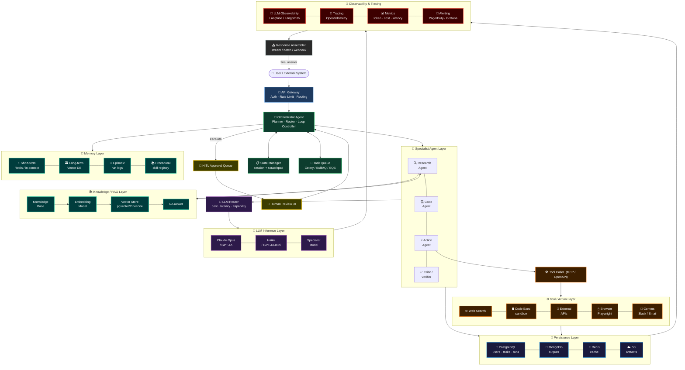

# Agentic AI & Multi-Agent Orchestration — Master Template HLD

> Equivalent to the Backend System Design HLD Master Template, but for AI agent systems.
> Every production agentic system is a composition of these layers.

---

## Full Architecture



---

## Layer Reference

| Layer | What it does | Key technologies |
|---|---|---|
| **Entry** | Auth, routing, rate limiting | API Gateway, OAuth, JWT |
| **Orchestration** | Plans tasks, routes to agents, manages state | LangGraph, CrewAI, custom planner |
| **Specialist Agents** | Domain-specific reasoning and action | ReAct loop, tool-use, reflection |
| **LLM Inference** | Language model calls, cost/latency routing | Claude, GPT-4o, Gemini, vLLM |
| **Tools / Actions** | Real-world side effects | MCP, OpenAPI, Playwright, sandboxed exec |
| **Memory** | Short-term (context), long-term (vector), episodic | Redis, Pinecone, Weaviate, pgvector |
| **RAG / Knowledge** | Retrieval-augmented generation pipeline | Embeddings, re-ranker, vector store |
| **Persistence** | Durable storage for runs, users, artifacts | PostgreSQL, MongoDB, S3, Redis |
| **Observability** | Traces, token usage, cost, errors | Langfuse, LangSmith, OpenTelemetry |
| **HITL** | Human approval for high-risk / low-confidence actions | Approval queues, Slack bots |
| **Output** | Assembles and delivers final response or artifact | Streaming, batch, webhooks |

---

## Key Differences from Backend HLD

| Backend HLD | Agentic AI HLD |
|---|---|
| Load Balancer | Orchestrator Agent |
| Microservices | Specialist Agents |
| Database reads | Memory (short/long-term) + RAG |
| Message Queue | Task Queue + Agent loops |
| API calls | Tool calls (MCP / OpenAPI) |
| Logging | LLM Observability + Tracing |
| Human ops | Human-in-the-Loop (HITL) layer |
```
